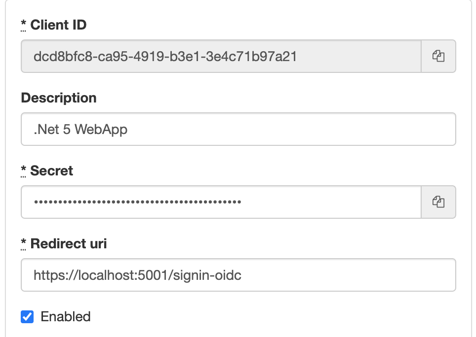

# ASP.NET 5 OpenID Connect Federated Authentication Example

Example configuration for authentication ASP.NET framework with Notakey Authentication server using OIDC protocol.

## Getting Started

* Enable OpenID Connect Server for your Notakey service using management dashboard. Choose service, navigate to Settings >> OpenID Connect configuration >> Configure and enable service there.

* Register this client application with Notakey service. To add client choose service, navigate to Settings >> OpenID Connect configuration >> Clients. Your callback URL will be https://localhost:5001/signin-oidc

<!--  -->

* Build image with `docker build ./ -t mybuiltimage`

* Run image

```shell
docker run -it --rm \
  -p 5002:5000 \
  -p 5003:5001 \
  --name my-oidc-client \
  -e OIDC_CLIENT_ID="dcd...a21" \
  -e OIDC_CLIENT_SECRET="CWH...sEM" \
  -e OIDC_AUTHORITY="https://<ntkas-api-url>/oidc/services/<service-id>/" \
  mybuiltimage
```

    * OIDC_CLIENT_ID - This is the client ID generated during client configuration in step 1.

    * OIDC_CLIENT_SECRET - This is the client secret generated during client configuration in step 1.

    * OIDC_AUTHORITY - OpenID Connect server's base URL. \<ntkas-api-url\> is FQDN you have configured for Notakey Authentication Server, \<service-id\> identifies service  to bind this client application to in your domain, can be found in service settings in management dashboard.

* Try out access to https://localhost:5001 and ignore HTTP SSL error. If certificate needs to be added to trust store, it can be found in `/certs`

## Project creation

This project was created with mvc template.

```shell
dotnet new mvc -n NotakeyOidcDemo
```

OpenID Client support can be added with

```shell
dotnet add package Microsoft.AspNetCore.Authentication.OpenIdConnect
```

## Getting Help

https://documentation.notakey.com/

https://support.notakey.com/

